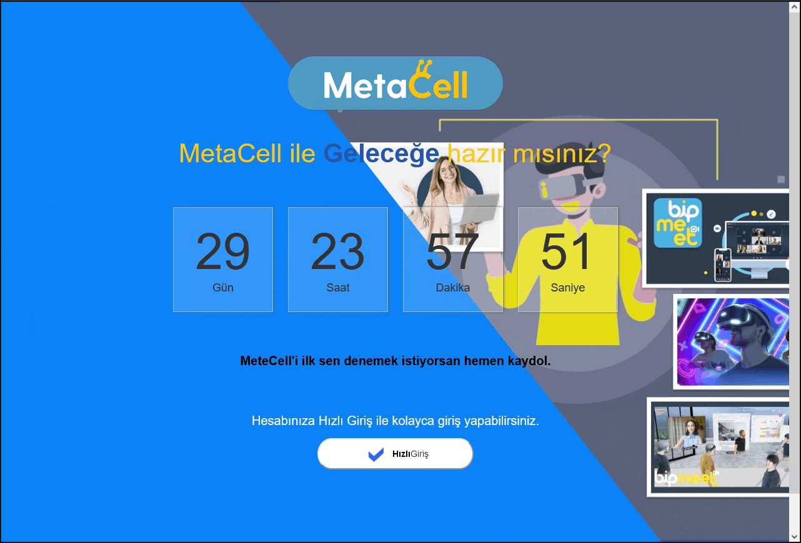
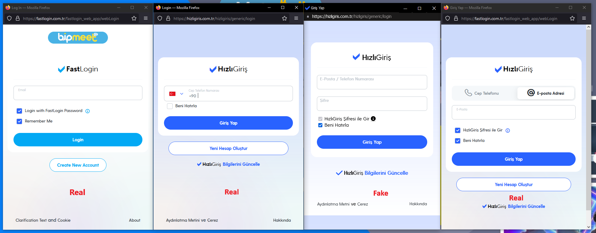
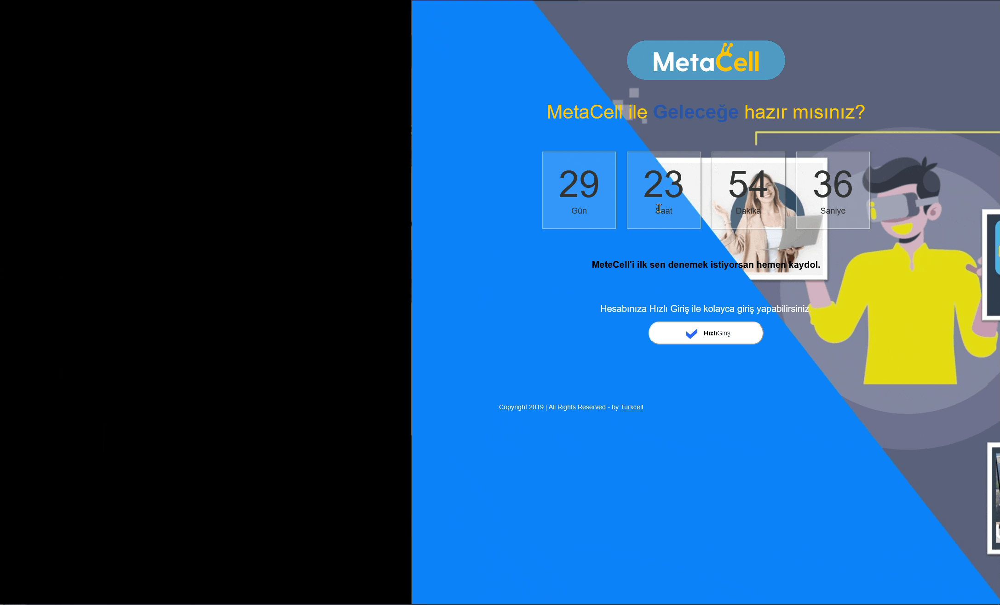
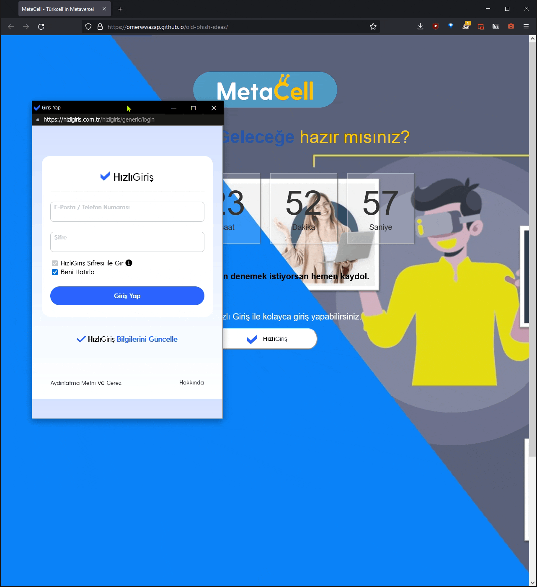
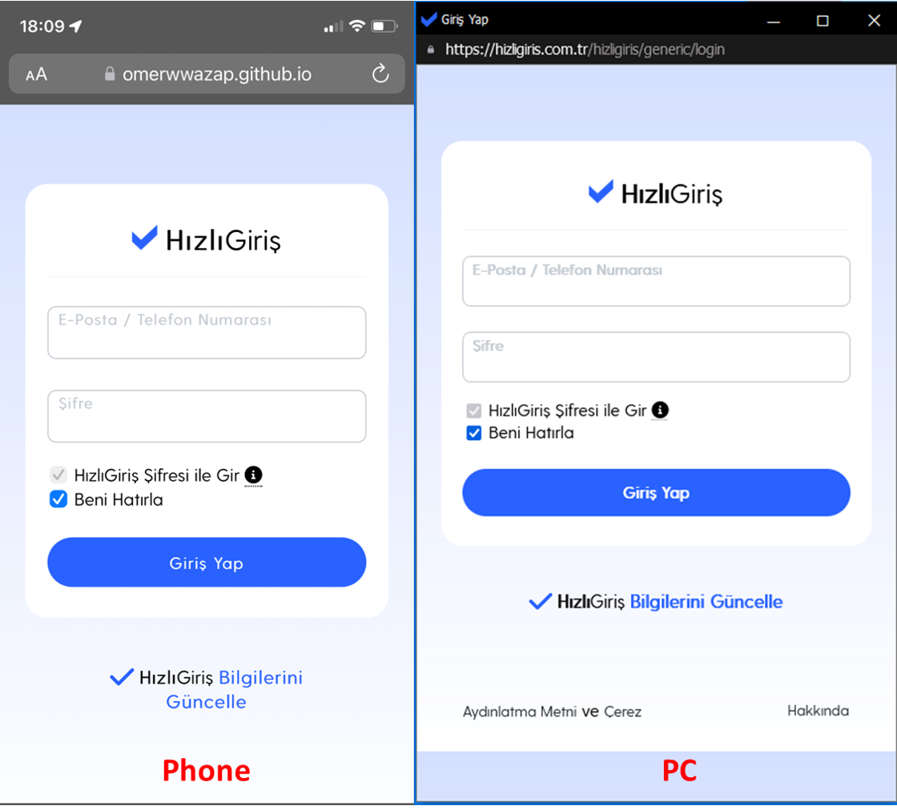

## Browser In The Browser (BITB) Attack - Turkcell FastLogin/HızlıGiriş

BITB template for Turkcell's FastLogin/HızlıGiriş SSO service. Used in internal Phishing attacks as such it is designed to **NOT** be an exact copy of the real SSO.

### Information

- Detects Color Preference for the browser. Dark or Light
- Selection fix o prevent unnecessary selection for certain regions.
- CSS to use System Default Fonts instead of browser fallback fonts
- Has slight delay to the pop-up window as it appears.
- *On phones and small displays, it opens the BITB as a new page/tab.
- *Dragging the windows doesn't work on phones, didn't bother to add the functionally.

### Demo

### Original vs BITB

### Detecting BITB

- **Dragging the Window** PC ✅ | Phone ❌
  - Drag the window to the edge of the browser. If the window cannot escape the browser then it's not a real window.
  - 
- **Minimize / Close the Windows** PC ✅ | Phone ❌
  - Minimize or Close button will not work as intended as CSS/JS doesn't have the functionality to mimic the actual action and since there is no open windows to close or minimize.
- **Maximize the Windows** PC ✅ | Phone ❌
  - Maximize button will not work as intended as CSS/JS doesn't have the functionality to mimic the actual action.
  - 
- **Resizing the Window** PC ✅ | Phone ❌
  - This effect could be mimicked with CSS/JS but this repo doesn't have it.
- **Checking the Link** PC ❌ | Phone ✅
  - If the BITB opens on a new page for small screened devices, the only ways to catch the BIBT is trough the link - url bar.  
  - 
- **Browser extension** PC ✅ | Phone ❌
  - @odacavo released a great browser extension that can detect and warn users about embedded iframe.
  - [Repo Available Here.](https://github.com/odacavo/enhanced-iframe-protection)

### Using

- Simply add a backend service to the BITB to receive the inputs.

### Credits

- Web Template from: [Tech City Free Coming Soon Bootstrap Responsive Template](https://github.com/learning-zone/website-templates)
- Browser In The Browser (BITB) Repo: [mrd0x/BITB](https://github.com/mrd0x/BITB)
  - [Browser In The Browser (BITB) Attack](https://mrd0x.com/browser-in-the-browser-phishing-attack/)
- Also Check Out
  - [BITB - Framework](https://github.com/surya-dev-singh/BITB-framwork)
  - [Modern Phishing Tool With Advanced Functionality  - Hidden Eye](https://github.com/darkmidus/HiddenEye)
